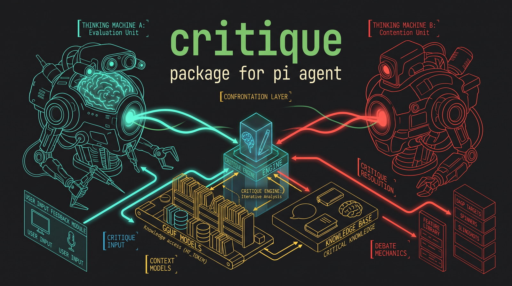

<div align="center">



</div>

# Critique — Adversarial Review for pi

**Critique questions the last work step with a separate model and can challenge user instructions before the model starts.** It is not limited to code: it can review implementation work, writing, plans, research, data analysis, ops, or any other project work. Optionally, Critique also runs a fast pre-flight check on sufficiently rich user prompts and shows a short `Critique` widget when the instruction deserves pushback. The feedback is **non-mandatory**: the user and the working model remain the final judges.

---

## Features

- **Independent reviewer** — a separate model questions the work step from serialized context, with no tools of its own (can't modify files or see hidden state)
- **Auto-detects the work step** — splits the session branch into *episodes* at user-message boundaries; the last episode containing tool calls or assistant output is the work step
- **Token-budgeted context** — the user prompt, assistant messages, tool calls and tool results are truncated to a self-contained block so the reviewer sees what it needs without overflow
- **Multi-step review** — review the last `N` episodes in one shot (`/critique 3`) to catch cross-step issues
- **Focus note** — `/critique check the assumptions` biases the review without limiting it; the reviewer still scans for everything
- **Structured output** — fixed `Verdict / Issues / Suggestions / Summary` schema for actionable, parseable feedback
- **Settings menu** — `/critique config` opens an editable menu so you can change one setting at a time without rerunning a full wizard
- **Advisory injection** — on by default; toggle off (or use `/critique view`) to keep the review as read-only
- **Cancelable loader** — in TUI mode, the review runs behind a loader that you can abort with `Esc`
- **No provider surprises** — empty reviews are flagged, provider errors are surfaced as errors instead of silently producing nothing
- **Automatic prompt critique** — optional pre-flight challenge for user instructions before the model starts; trivial inputs (`ok`, tiny commands, quick corrections) are ignored
- **Three prompt-critique levels** — `Inconsistencies only` (low sensitivity), `Critical` (moderate), or `Corrosive` (high)
- **Prompt-critique model source** — use either the active working model or the configured critique model
- **Interactive Critique widget** — ultra-short one-sentence advice in the user's interaction language with `Accept`, `Discard`, or `Reply`; auto-discards after 30 seconds
- **Persistent config** — `~/.pi/agent/critique.json` stores model choice, auto-inject, and automatic prompt-critique settings across all projects

## Install

Critique is a [pi package](https://pi.dev/packages): one extension (`src/index.ts`) declared in `package.json`.

```bash
# From GitHub
pi install git:github.com/noguerol/critique

# Pin a tag/commit
pi install git:github.com/noguerol/critique@v1.0.0

# From npm
pi install npm:pi-critique-model

# Local checkout (development)
pi install /path/to/critique

# Try it for one run only
pi -e git:github.com/noguerol/critique
```

```bash
pi list                      # show installed packages
pi remove npm:pi-critique-model
```

> **Security:** pi packages run with full system access — extensions execute arbitrary code. Install only packages you trust and review the source.

**Requirements:** a working pi installation with at least one configured model. For independent reviews, configure a second model as reviewer.

## Quick Start

```
/critique config        # (optional) open the settings menu
...                     # let the main model do some work
/critique               # review the last work step and feed the feedback back
```

The main model then sees the review appended to its next turn and decides what to apply. With auto-inject off (or `/critique view`), the review is only displayed to you.

To focus the review:

```
/critique check the assumptions behind the plan
/critique 3                             # review the last 3 work steps
/critique 2 look at the evidence gaps   # combine count + focus
```

## Commands

| Command | Description |
|---------|-------------|
| `/critique` | Review/question the last work step and inject feedback into the working model |
| `/critique <focus>` | Review the last work step with an additional focus note |
| `/critique N` | Review the last `N` work steps (max 5) |
| `/critique N <focus>` | Combine count and focus |
| `/critique view` | Show the review only, without injecting it |
| `/critique view <focus>` | View-only, with a focus note |
| `/critique view N` | View-only, last `N` steps |
| `/critique config` | Open the editable settings menu for model, auto-inject, and automatic prompt critique |

**Argument parsing:**

- A leading integer (`1`–`5`) sets the number of work steps to review.
- `config` or `view` after the slash sets the mode.
- Anything else is treated as a focus note and prepended to the reviewer prompt.

## How It Works

### 1. Extract the work step

The session branch is split into *episodes* at user-message boundaries. The last episode containing tool calls or assistant output is the work step: the user request that triggered it, every tool call (with arguments), and every tool result (diffs, command output, data, errors). Content is truncated to a token budget so the reviewer sees focused, self-contained context:

| Field | Max chars |
|-------|-----------|
| User prompt | 12,000 |
| Assistant text | 8,000 |
| Tool args | 4,000 each |
| Tool result | 8,000 each |
| Total | 60,000 |

Truncated content is marked with `… [truncated]` so the reviewer can tell what it did and didn't see.

### 2. Ask the reviewer

The critique model is called directly through `ctx.modelRegistry.complete()` with **no tools** — it only judges/questions. The reviewer is told:

- The work step inside `<work-step>` tags
- An optional `<focus-note>` if you passed one
- "Do not invent issues: if the work is sound, say so and keep suggestions minimal"

It replies in a fixed Markdown structure:

```
## Verdict
APPROVED | APPROVED_WITH_SUGGESTIONS | CHANGES_RECOMMENDED

## Issues
- [severity: critical|major|minor] description

## Suggestions
- concrete, actionable suggestion

## Summary
2-4 sentence overall assessment.
```

The reviewer is told to base its judgment *only* on the provided work step, across any domain: code, writing, planning, research, data, ops, etc.

### 3. Inject the feedback

The review is sent back to the working model as a follow-up user message:

```
[Critique — advisory]

Reviewer: `provider/model`. Advice only: apply useful points; briefly reject bad ones.

---

<the review>
```

The main model then has the freedom to apply, partially apply, or reject each point. If auto-inject is off, the review is only shown to you.

### 4. Optional automatic prompt critique

When enabled in `/critique config`, Critique listens to user input before prompt-template expansion and before the agent starts. A local heuristic skips acknowledgements, slash commands, tiny corrections, and short commands. For richer instructions, a tool-free model call decides whether there is anything worth challenging.

If critique is useful, pi shows an ultra-short `Critique` widget in the user's interaction language. The model always returns both an issue and a proposed fix:

- `Accept` includes the proposed fix as extra guidance for the model.
- `Discard` sends the original prompt unchanged.
- `Reply` lets the user answer the critique/fix before the model sees the prompt.
- No interaction within 30 seconds auto-discards the advice and sends the original prompt unchanged.

Automatic prompt critique can use either the active working model or the configured critique model. It does not require a separate model.

## Model Selection

`/critique config` opens an editable settings menu. Select a setting to change only that value, toggle booleans directly, or choose `Done`/`Esc` to close. Changes are persisted as soon as each setting is edited.

The `Critique model` entry opens the critic model picker. It only offers models with configured auth, **only** from pi's native model registry — the same list you see in `/model`. The picker shows at most ten entries at a time and scrolls past that.

**Auto** (the default) prefers a *different* model than the working one, so the review is genuinely independent. If no second model is available, it falls back to the working model and warns you when it runs.

If you pin a specific model that's later removed or uninstalled, critique silently falls back to Auto.

If the critique model and the working model are the same, critique warns you — pick a different reviewer to get a genuinely independent second opinion.

## Configuration

The config is persisted as JSON at `~/.pi/agent/critique.json`:

```json
{
  "model": "anthropic/claude-sonnet-4",
  "autoInject": true,
  "autoPromptCritique": false,
  "autoPromptCritiqueLevel": "inconsistencies",
  "autoPromptCritiqueModel": "working"
}
```

- **`model`** — canonical `provider/modelId` of the reviewer. Empty string = Auto (different from working model).
- **`autoInject`** — when `true`, the review is injected back into the working model. When `false`, the review is only displayed.
- **`autoPromptCritique`** — when `true`, sufficiently rich user instructions are challenged before the model starts.
- **`autoPromptCritiqueLevel`** — `inconsistencies` only flags real misunderstanding risks; `critical` is moderate; `corrosive` is highly sensitive and skips only clearly logical/complete prompts.
- **`autoPromptCritiqueModel`** — `working` uses the active model; `critique` uses the configured critique model.

The settings menu offers any model with configured auth that's available in pi's registry; the config persists per-machine (in `getAgentDir()`), shared across all projects.

## Architecture

```
critique/
├── package.json        # pi package manifest (pi-package)
├── LICENSE             # MIT
├── README.md
├── docs/
│   ├── banner.png      # wide README header
│   └── preview.png     # npm pi.dev preview card
├── screenshot.png      # full-res master
└── src/
    ├── index.ts             # /critique command surface, config UI, review UI, input hook
    ├── config.ts            # persistence + model resolution: pinned, auto, fallback
    ├── prompt-critique.ts   # automatic user-prompt critique prompt, gate, model call
    ├── work-step.ts         # episode splitting + token-budgeted serialization
    └── review.ts            # reviewer prompt + model call + injected-message builder
```

Five-file extension with zero external dependencies (only pi's bundled `@earendil-works/*` + Node built-ins):

- **Episode splitter** — splits a session branch into user-message-bounded episodes, picks the last one with work
- **Token budgeter** — hard caps per field, marks truncations so the reviewer knows what it didn't see
- **Reviewer call** — tool-free `ctx.modelRegistry.complete()` with a domain-general structured prompt
- **Advisory formatter** — wraps the review in a "non-mandatory" envelope before injecting as a follow-up user message
- **Prompt critique** — optional input hook with local trivial-prompt gate, three challenge levels, and ultra-short JSON model output
- **UI** — lazy-loaded pickers/viewers/loaders + 30-second Critique widget

## Notes

- The critique model runs with **no tools** and never touches the filesystem. It judges purely from the serialized work step, whatever the domain.
- In TUI mode the review runs behind a cancelable loader (Esc aborts) and `/critique view` opens a scrollable Markdown viewer. Automatic prompt critique appears as a compact `Critique` widget with a 30-second auto-discard timeout. In RPC mode reviews are surfaced through notifications/dialogs; print mode logs manual reviews to stdout and skips automatic prompt critique.
- Provider errors (bad keys, insufficient balance, rate limit) are surfaced as errors instead of silently producing empty reviews.
- Reviews are capped at 16,000 chars to keep the injected follow-up reasonable; longer reviews are truncated with `… [review truncated]`.

## License

[MIT](LICENSE) © Javier Noguerol
